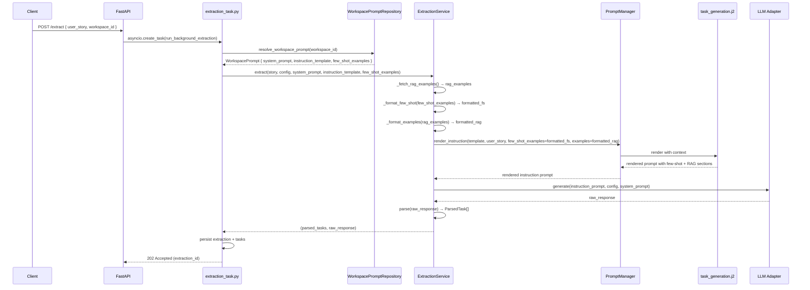
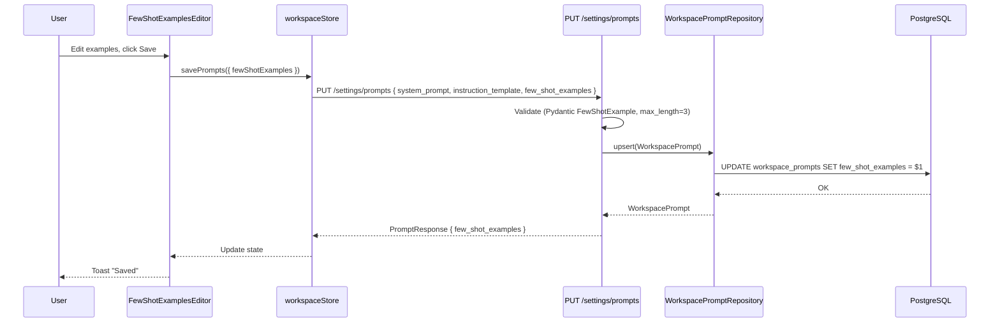

# SDD Technical Design: Few-Shot Examples in Workspace Prompt Configuration

> **Change ID**: `few-shot-examples`  
> **Status**: `design` — ready for Tasks phase  
> **Based on Spec**: `openspec/changes/few-shot-examples/spec.md`  
> **Created**: 2026-09-10

---

## 1. Architecture Overview

### 1.1 High-Level Component Diagram

```mermaid
graph TD
    subgraph Frontend [Frontend - Astro + React Islands]
        UI[LLMConfigEditor<br/>(Workspace Settings)]
        FSE[FewShotExamplesEditor<br/>NEW React Island]
        WS[workspaceStore<br/>Zustand]
    end

    subgraph API [FastAPI Backend]
        GET_P[GET /settings/prompts]
        PUT_P[PUT /settings/prompts]
        EXT[POST /extract]
    end

    subgraph Pipeline [Extraction Pipeline]
        ET[extraction_task.py<br/>_run_extraction()]
        RWP[resolve_workspace_prompt()]
        ES[ExtractionService.extract()]
        PM[PromptManager.render_instruction()]
        J2[task_generation.j2<br/>Jinja2 Template]
        LLM[LLM Adapter<br/>(Ollama/Gemini)]
    end

    subgraph Data [Persistence]
        DB[(PostgreSQL<br/>workspace_prompts.few_shot_examples JSONB)]
    end

    UI -->|renders| FSE
    FSE -->|reads/writes| WS
    WS -->|savePrompts| PUT_P
    WS -->|loadPrompts| GET_P
    GET_P -->|resolves| RWP
    PUT_P -->|upserts| DB
    EXT -->|triggers| ET
    ET -->|calls| RWP
    RWP -->|returns| WS_P[WorkspacePrompt<br/>with few_shot_examples]
    ET -->|passes| ES
    ES -->|formats & threads| PM
    PM -->|renders| J2
    J2 -->|includes few-shot block| LLM
```

### 1.2 Integration Points in Existing Pipeline

| Stage | Current | With Few-Shot |
|-------|---------|---------------|
| **Workspace Prompt Resolution** | Returns `system_prompt`, `instruction_template` | Also returns `few_shot_examples` (already in entity) |
| **ExtractionService.extract()** | Params: `user_story`, `config`, `system_prompt`, `instruction_template` | + `few_shot_examples: list[FewShotExample] \| None` |
| **PromptManager.render_instruction()** | Context: `user_story`, `examples` (RAG) | + `few_shot_examples` |
| **Jinja Template** | Renders RAG `examples` section | Renders few-shot section **before** RAG |
| **ExtractionTask** | Calls `extract()` with system/instruction | Passes `ws_prompt.few_shot_examples` |

---

## 2. Backend Design

### 2.1 Domain Types

**File**: `backend/src/storico/domain/ports.py` (add to existing)

```python
"""Few-shot example type for workspace prompt configuration."""

from typing import TypedDict


class FewShotExample(TypedDict):
    """A single few-shot example for task extraction prompt.

    Attributes:
        user_story: The input user story text (min 10 chars).
        tasks: Expected task breakdown output matching the exact format
               the LLM should produce (numbered summary/description).
    """
    user_story: str
    tasks: str
```

**File**: `backend/src/storico/domain/entities/workspace_prompt.py` (existing — already has `few_shot_examples`)

```python
# Already exists — no changes needed
@dataclass
class WorkspacePrompt:
    workspace_id: UUID
    system_prompt: str | None = None
    instruction_template: str | None = None
    few_shot_examples: list[FewShotExample] | None = None  # JSONB in DB
```

### 2.2 ExtractionService Changes

**File**: `backend/src/storico/domain/services/extraction_service.py`

```python
class ExtractionService:
    # ... existing init ...

    async def extract(
        self,
        user_story: object,
        config: LLMConfig,
        system_prompt: str | None = None,
        instruction_template: str | None = None,
        few_shot_examples: list[FewShotExample] | None = None,  # NEW
    ) -> tuple[list[ParsedTask], str]:
        """Run the extraction pipeline (prompt → LLM → parse) without persistence.

        Args:
            user_story: Domain entity with ``raw_text`` attribute.
            config: LLM configuration.
            system_prompt: Workspace system prompt.
            instruction_template: Workspace instruction template (Jinja2).
            few_shot_examples: Workspace few-shot examples (style reference).

        Returns:
            Tuple of (parsed_tasks, raw_response).
        """
        raw_text = getattr(user_story, "raw_text", str(user_story))

        # RAG: search for similar past extractions
        examples = await self._fetch_rag_examples(raw_text)

        # Build prompt kwargs
        prompt_kwargs: dict[str, object] = {"user_story": raw_text}

        # Few-shot examples (style reference) — injected FIRST
        if few_shot_examples:
            prompt_kwargs["few_shot_examples"] = self._format_few_shot(few_shot_examples)

        # RAG examples (historical context) — injected SECOND
        if examples:
            prompt_kwargs["examples"] = self._format_examples(examples)

        instruction_prompt = self._prompt_manager.render_instruction(
            instruction_template,
            **prompt_kwargs,
        )

        # ... rest unchanged (LLM call, parse, return) ...
```

**New Helper Method**:

```python
    def _format_few_shot(self, examples: list[FewShotExample]) -> str:
        """Format few-shot examples for injection into the prompt template.

        Each example rendered as:
        User Story: <story>
        Tasks:
        <tasks>
        ---
        """
        blocks: list[str] = []
        for i, ex in enumerate(examples, start=1):
            blocks.append(
                f"User Story: {ex['user_story']}\n"
                f"Tasks:\n{ex['tasks']}\n"
                f"---"
            )
        return "\n\n".join(blocks)
```

### 2.3 PromptManager Changes

**File**: `backend/src/storico/infrastructure/llm/prompt_manager.py`

```python
    def render_instruction(
        self,
        instruction_template: str | None,
        few_shot_examples: list[FewShotExample] | None = None,  # NEW explicit param (optional)
        **kwargs: object,
    ) -> str:
        """Render the task-generation instruction prompt.

        Args:
            instruction_template: Inline Jinja2 template text, or ``None`` for default.
            few_shot_examples: Optional few-shot examples for style reference.
            **kwargs: Other variables (user_story, examples/RAG, etc.).

        Returns:
            Rendered instruction prompt string.
        """
        # Include few_shot_examples in template context if provided
        if few_shot_examples is not None:
            kwargs["few_shot_examples"] = few_shot_examples

        if instruction_template is None:
            return self.render("task_generation.j2", **kwargs)
        return Template(instruction_template).render(**kwargs)
```

> **Note**: Using explicit `few_shot_examples` param (with default) maintains backward compatibility with any direct callers.

### 2.4 Template Update

**File**: `backend/src/storico/infrastructure/llm/prompts/task_generation.j2`

```jinja2
{{ system_prompt }}

{{ instruction_prompt }}


## Few-Shot Examples (Style Reference)

User Story: {{ ex.user_story }}
Tasks:
{{ ex.tasks }}
---




## Relevant Historical Examples
{{ examples }}

Now break down the following user story:


User story:
{{ user_story }}
```

**Section Ordering Rationale**:
1. **Few-Shot Examples (Style Reference)** — Static, admin-defined, teaches *format/style*
2. **Relevant Historical Examples (RAG)** — Dynamic, similarity-based, teaches *domain patterns*
3. **Target User Story** — The actual input

This ordering ensures the model internalizes the desired output format first, then sees relevant domain examples, then processes the target.

### 2.5 ExtractionTask Wiring

**File**: `backend/src/storico/infrastructure/tasks/extraction_task.py`

In `_run_extraction()` (around line 303):

```python
        # ... existing code ...
        
        # Resolve the workspace prompt config
        prompt_repo = SQLAlchemyWorkspacePromptRepository(session)
        ws_prompt = await resolve_workspace_prompt(
            workspace_id, prompt_repo, prompt_manager
        )
        system_prompt = ws_prompt.system_prompt
        instruction_template = ws_prompt.instruction_template
        few_shot_examples = ws_prompt.few_shot_examples  # NEW: extract

        # ... existing code ...

        # Run extraction — pass few_shot_examples
        parsed_tasks, raw_response = await extraction_service.extract(
            story,
            llm_config,
            system_prompt=system_prompt,
            instruction_template=instruction_template,
            few_shot_examples=few_shot_examples,  # NEW
        )
```

### 2.6 API Validation (Pydantic)

**File**: `backend/src/storico/api/schemas/workspace_prompt.py`

```python
"""Workspace prompt Pydantic schemas for Storico API."""

from pydantic import BaseModel, ConfigDict, Field
from typing import Annotated


class FewShotExample(BaseModel):
    """Single few-shot example for task extraction."""

    model_config = ConfigDict(extra="forbid")

    user_story: Annotated[str, Field(min_length=10, description="Input user story")]
    tasks: Annotated[str, Field(min_length=20, description="Expected task breakdown output")]


class PromptRequest(BaseModel):
    """Request body for upserting workspace prompts."""

    model_config = ConfigDict(extra="forbid")

    system_prompt: str | None = None
    instruction_template: str | None = None
    few_shot_examples: Annotated[
        list[FewShotExample] | None,
        Field(default=None, max_length=3, description="Max 3 few-shot examples")
    ] = None


class PromptResponse(BaseModel):
    """Response body representing workspace prompts."""

    model_config = ConfigDict(from_attributes=True)

    system_prompt: str | None = None
    instruction_template: str | None = None
    few_shot_examples: list[FewShotExample] | None = None
```

### 2.7 API Endpoint (Already Exists — No Changes)

**File**: `backend/src/storico/api/routes/workspace_settings.py` — `upsert_prompts` already merges `few_shot_examples` from request body.

---

## 3. Frontend Design

### 3.1 Component Hierarchy

```
LLMConfigEditor (React Island in WorkspaceSettings.tsx)
├── SystemPromptEditor (existing)
├── InstructionPromptEditor (existing)
└── FewShotExamplesEditor (NEW)
    ├── FewShotExampleList
    │   ├── FewShotExampleRow[] (max 3)
    │   │   ├── UserStoryTextarea (required, min 10)
    │   │   ├── TasksTextarea (required, min 20, format hint placeholder)
    │   │   ├── MoveUpButton / MoveDownButton (reorder)
    │   │   └── RemoveButton
    │   └── AddExampleButton (disabled when length === 3)
    └── ValidationSummary (inline errors below Save button)
```

### 3.2 New Component: `FewShotExamplesEditor`

**File**: `frontend/src/components/react/FewShotExamplesEditor.tsx` (NEW)

```tsx
import { useState } from "react";
import { GripVertical, Trash2, ChevronUp, ChevronDown, AlertCircle, CheckCircle } from "lucide-react";
import { Button } from "@/components/ui/button";
import { Textarea } from "@/components/ui/textarea";
import { Card, CardContent } from "@/components/ui/card";
import { Separator } from "@/components/ui/separator";
import { useUIStore } from "@/stores/uiStore";
import { localizedPath, type Locale } from "@/i18n/utils";
import en from "@/i18n/en.json";
import es from "@/i18n/es.json";

interface FewShotExample {
  user_story: string;
  tasks: string;
}

interface FewShotExamplesEditorProps {
  locale: Locale;
  examples: FewShotExample[];
  onChange: (examples: FewShotExample[]) => void;
  maxExamples?: number; // default 3
}

const TASKS_FORMAT_HINT = `1. summary: Set up database schema for transactions
description: Create the necessary database tables and indexes to store transaction history records with fields for date, amount, type, and notes.

2. summary: Implement transaction listing API endpoint
description: Build a REST API endpoint that returns paginated transaction history for a given user, with support for date filtering and sorting.`;

export function FewShotExamplesEditor({
  locale,
  examples: initialExamples,
  onChange,
  maxExamples = 3,
}: FewShotExamplesEditorProps) {
  const t = locale === "es" ? es : en;
  const { theme: rawTheme } = useUIStore();
  const resolvedTheme = rawTheme === "system"
    ? typeof window !== "undefined" && window.matchMedia("(prefers-color-scheme: dark)").matches
      ? "dark"
      : "light"
    : rawTheme;

  const [examples, setExamples] = useState<FewShotExample[]>(initialExamples);
  const [errors, setErrors] = useState<Record<number, { user_story?: string; tasks?: string }>>({});

  // Validate on change
  const validate = (idx: number, field: "user_story" | "tasks", value: string) => {
    const newErrors = { ...errors };
    if (field === "user_story" && value.trim().length < 10) {
      newErrors[idx] = { ...newErrors[idx], user_story: t.workspace?.fewShotUserStoryMin ?? "User Story must be at least 10 characters" };
    } else if (field === "tasks" && value.trim().length < 20) {
      newErrors[idx] = { ...newErrors[idx], tasks: t.workspace?.fewShotTasksMin ?? "Tasks must be at least 20 characters" };
    } else {
      if (newErrors[idx]) {
        delete newErrors[idx][field];
        if (Object.keys(newErrors[idx]).length === 0) delete newErrors[idx];
      }
    }
    setErrors(newErrors);
  };

  const handleUserStoryChange = (idx: number, value: string) => {
    const next = [...examples];
    next[idx] = { ...next[idx], user_story: value };
    setExamples(next);
    onChange(next);
    validate(idx, "user_story", value);
  };

  const handleTasksChange = (idx: number, value: string) => {
    const next = [...examples];
    next[idx] = { ...next[idx], tasks: value };
    setExamples(next);
    onChange(next);
    validate(idx, "tasks", value);
  };

  const addExample = () => {
    if (examples.length >= maxExamples) return;
    const next = [...examples, { user_story: "", tasks: "" }];
    setExamples(next);
    onChange(next);
  };

  const removeExample = (idx: number) => {
    const next = examples.filter((_, i) => i !== idx);
    setExamples(next);
    onChange(next);
    const newErrors = { ...errors };
    delete newErrors[idx];
    // Re-index remaining errors
    setErrors(Object.fromEntries(
      Object.entries(newErrors).map(([k, v]) => [parseInt(k, 10) > idx ? parseInt(k, 10) - 1 : parseInt(k, 10), v])
    ));
  };

  const moveExample = (fromIdx: number, toIdx: number) => {
    if (toIdx < 0 || toIdx >= examples.length) return;
    const next = [...examples];
    const [item] = next.splice(fromIdx, 1);
    next.splice(toIdx, 0, item);
    setExamples(next);
    onChange(next);
    // Re-index errors
    const newErrors: Record<number, typeof errors[number]> = {};
    Object.entries(errors).forEach(([k, v]) => {
      const oldIdx = parseInt(k, 10);
      let newIdx = oldIdx;
      if (oldIdx === fromIdx) newIdx = toIdx;
      else if (fromIdx < toIdx && oldIdx > fromIdx && oldIdx <= toIdx) newIdx = oldIdx - 1;
      else if (fromIdx > toIdx && oldIdx >= toIdx && oldIdx < fromIdx) newIdx = oldIdx + 1;
      newErrors[newIdx] = v;
    });
    setErrors(newErrors);
  };

  const hasErrors = Object.keys(errors).length > 0;
  const isValid = examples.every((ex, i) =>
    ex.user_story.trim().length >= 10 && ex.tasks.trim().length >= 20
  );

  return (
    <Card>
      <CardContent className="pt-0">
        <div className="flex items-center justify-between mb-4">
          <h4 className="text-sm font-medium text-(--color-text)">
            {t.workspace?.fewShotTitle ?? "Few-Shot Examples"}
          </h4>
          <span className="text-xs text-(--color-text-tertiary)">
            {examples.length} / {maxExamples}
          </span>
        </div>

        <div className="space-y-3">
          {examples.map((ex, idx) => (
            <div key={idx} className="space-y-2 p-3 rounded-lg border border-(--color-border) bg-(--color-surface-secondary)/30">
              {/* Drag handle + remove */}
              <div className="flex items-start gap-2">
                <Button
                  type="button"
                  variant="ghost"
                  size="icon"
                  className="h-7 w-7 text-(--color-text-tertiary) hover:text-(--color-text) shrink-0"
                  onClick={() => moveExample(idx, idx - 1)}
                  disabled={idx === 0}
                  aria-label={t.workspace?.moveUp ?? "Move up"}
                >
                  <ChevronUp className="h-4 w-4" />
                </Button>
                <Button
                  type="button"
                  variant="ghost"
                  size="icon"
                  className="h-7 w-7 text-(--color-text-tertiary) hover:text-(--color-text) shrink-0"
                  onClick={() => moveExample(idx, idx + 1)}
                  disabled={idx === examples.length - 1}
                  aria-label={t.workspace?.moveDown ?? "Move down"}
                >
                  <ChevronDown className="h-4 w-4" />
                </Button>
                <div className="flex-1" />
                <Button
                  type="button"
                  variant="ghost"
                  size="icon"
                  className="h-7 w-7 text-red-500 hover:text-red-600 shrink-0"
                  onClick={() => removeExample(idx)}
                  aria-label={t.workspace?.removeExample ?? "Remove example"}
                >
                  <Trash2 className="h-4 w-4" />
                </Button>
              </div>

              {/* User Story textarea */}
              <div className="space-y-1">
                <label className="text-xs font-medium text-(--color-text)">
                  {t.workspace?.fewShotUserStoryLabel ?? "User Story"}
                </label>
                <Textarea
                  value={ex.user_story}
                  onChange={(e) => handleUserStoryChange(idx, e.target.value)}
                  rows={3}
                  placeholder={t.workspace?.fewShotUserStoryPlaceholder ?? "As a user, I want to log in so that I can access my account"}
                  className={`min-h-[5rem] ${errors[idx]?.user_story ? "border-red-500 focus:border-red-500 focus:ring-red-500/20" : ""}`}
                />
                {errors[idx]?.user_story && (
                  <p className="text-xs text-red-500 flex items-center gap-1">
                    <AlertCircle className="h-3 w-3" />
                    {errors[idx].user_story}
                  </p>
                )}
              </div>

              {/* Tasks textarea */}
              <div className="space-y-1">
                <label className="text-xs font-medium text-(--color-text)">
                  {t.workspace?.fewShotTasksLabel ?? "Expected Tasks Output"}
                </label>
                <Textarea
                  value={ex.tasks}
                  onChange={(e) => handleTasksChange(idx, e.target.value)}
                  rows={6}
                  placeholder={TASKS_FORMAT_HINT}
                  className={`min-h-[10rem] font-mono text-sm ${errors[idx]?.tasks ? "border-red-500 focus:border-red-500 focus:ring-red-500/20" : ""}`}
                />
                {errors[idx]?.tasks && (
                  <p className="text-xs text-red-500 flex items-center gap-1">
                    <AlertCircle className="h-3 w-3" />
                    {errors[idx].tasks}
                  </p>
                )}
              </div>

              {idx < examples.length - 1 && <Separator />}
            </div>
          ))}

          {examples.length < maxExamples && (
            <Button
              type="button"
              variant="outline"
              className="w-full"
              onClick={addExample}
            >
              <span className="flex items-center justify-center gap-2">
                <CheckCircle className="h-4 w-4 text-green-500" />
                {t.workspace?.addExample ?? "Add Example"}
              </span>
            </Button>
          )}

          {examples.length >= maxExamples && (
            <p className="text-xs text-(--color-text-tertiary) text-center">
              {t.workspace?.maxExamplesReached ?? "Maximum of 3 few-shot examples reached"}
            </p>
          )}
        </div>

        {hasErrors && (
          <div className="mt-3 p-3 rounded-lg border border-red-200 bg-red-50 dark:border-red-900 dark:bg-red-950/30">
            <p className="text-sm text-red-800 dark:text-red-200">
              {t.workspace?.fixValidationErrors ?? "Fix validation errors before saving"}
            </p>
          </div>
        )}
      </CardContent>
    </Card>
  );
}
```

### 3.3 Integration in `LLMConfigEditor`

**File**: `frontend/src/components/react/LLMConfigEditor.tsx` (NEW — extracted from WorkspaceSettings.tsx)

```tsx
// Extracted from WorkspaceSettings.tsx for reusability
// WorkspaceSettings.tsx will import and use this component

import { useState, useEffect, useCallback } from "react";
import { useUIStore } from "@/stores/uiStore";
import { LoaderCircle, Check, X, RotateCw, CircleHelp, TriangleAlert } from "lucide-react";
import { toast } from "sonner";
import { getLLMConfig, upsertLLMConfig, fetchAvailableModels } from "@/lib/llm-config-api";
import type { AvailableModel } from "@/lib/llm-config-api";
import { getPrompts, upsertPrompts } from "@/lib/prompts-api";
import { Button } from "@/components/ui/button";
import { Combobox, ComboboxInput, ComboboxContent, ComboboxList, ComboboxItem, ComboboxEmpty, ComboboxValue } from "@/components/ui/combobox";
import { Card, CardHeader, CardTitle, CardDescription, CardContent, CardFooter } from "@/components/ui/card";
import { Input } from "@/components/ui/input";
import { Slider } from "@/components/ui/slider";
import { Textarea } from "@/components/ui/textarea";
import { Field, FieldLabel, FieldDescription } from "@/components/ui/field";
import { Select, SelectContent, SelectItem, SelectTrigger } from "@/components/ui/select";
import { Separator } from "@/components/ui/separator";
import { ProviderIcon } from "@/components/ui/provider-icon";
import { FewShotExamplesEditor } from "@/components/react/FewShotExamplesEditor";
import type { WorkspaceLLMConfig, WorkspacePrompt } from "@/types/workspace";
import { useWorkspaceStore } from "@/stores/workspaceStore";
import en from "@/i18n/en.json";
import es from "@/i18n/es.json";

/* ... existing LLM config state & handlers ... */

/* Prompt Config State — now includes fewShotExamples */
const [prompts, setPrompts] = useState<WorkspacePrompt>({
  systemPrompt: "",
  instructionTemplate: "",
  fewShotExamples: [], // NEW
});
/* ... existing prompt handlers updated to include fewShotExamples ... */

const handlePromptSave = async () => {
  setPromptSaving(true);
  setPromptSaveResult("idle");
  try {
    await upsertPrompts(wsId, {
      systemPrompt: prompts.systemPrompt || undefined,
      instructionTemplate: prompts.instructionTemplate || undefined,
      fewShotExamples: prompts.fewShotExamples.length > 0 ? prompts.fewShotExamples : undefined, // NEW
    });
    /* ... existing success handling ... */
  } catch (err) {
    /* ... existing error handling ... */
  } finally {
    setPromptSaving(false);
  }
};

/* In render — Prompt Configuration Card: */
<Card>
  <CardHeader>
    <div className="flex items-center gap-2">
      <FileText className="h-4 w-4 text-(--color-text-secondary)" />
      <CardTitle>{t.workspace?.promptTitle ?? "Prompt Configuration"}</CardTitle>
    </div>
    <CardDescription>
      {t.workspace?.promptDescription ?? "Customize the prompts used for task extraction in this workspace"}
    </CardDescription>
  </CardHeader>
  <CardContent className="space-y-5">
    {/* System Prompt — existing */}
    <Field>...</Field>

    {/* Instruction Template — existing */}
    <Field>...</Field>

    {/* Few-Shot Examples Editor — NEW */}
    <FewShotExamplesEditor
      locale={locale}
      examples={prompts.fewShotExamples ?? []}
      onChange={(examples) => setPrompts((prev) => ({ ...prev, fewShotExamples: examples }))}
      maxExamples={3}
    />

    {/* Save Button — existing */}
  </CardContent>
</Card>
```

### 3.4 Workspace Store Updates

**File**: `frontend/src/stores/workspaceStore.ts`

```typescript
// In workspace prompt slice
interface WorkspacePromptState {
  systemPrompt: string;
  instructionTemplate: string;
  fewShotExamples: FewShotExample[]; // NEW
  // ... existing
}

// In actions
setPrompts: (prompts: Partial<WorkspacePromptState>) => set((state) => ({
  prompts: { ...state.prompts, ...prompts }
})),

// savePrompts action already sends all fields via API
```

### 3.5 Type Definitions

**File**: `frontend/src/types/workspace.ts`

```typescript
export interface FewShotExample {
  user_story: string;
  tasks: string;
}

export interface WorkspacePrompt {
  systemPrompt?: string | null;
  instructionTemplate?: string | null;
  fewShotExamples?: FewShotExample[] | null; // Tightened from Record<string, unknown>[]
}
```

**File**: `frontend/src/schemas/workspace.ts` (Zod)

```typescript
export const promptConfigSchema = z.object({
  systemPrompt: z.string().optional(),
  instructionTemplate: z.string().optional(),
  fewShotExamples: z.array(
    z.object({
      user_story: z.string().min(10),
      tasks: z.string().min(20),
    })
  ).max(3).optional(),
});
```

---

## 4. Data Flow Diagrams

### 4.1 Extraction Flow with Few-Shot



### 4.2 Settings Save Flow



---

## 5. API Validation Details

### 5.1 Request Validation

```python
# backend/src/storico/api/schemas/workspace_prompt.py
class PromptRequest(BaseModel):
    model_config = ConfigDict(extra="forbid")
    
    system_prompt: str | None = None
    instruction_template: str | None = None
    few_shot_examples: Annotated[
        list[FewShotExample] | None,
        Field(default=None, max_length=3)
    ] = None
```

### 5.2 Error Responses

**422 Unprocessable Entity — Empty User Story**:
```json
{
  "detail": [
    {
      "type": "string_too_short",
      "loc": ["body", "few_shot_examples", 0, "user_story"],
      "msg": "String should have at least 10 characters",
      "input": ""
    }
  ]
}
```

**422 Unprocessable Entity — Too Many Examples**:
```json
{
  "detail": [
    {
      "type": "list_too_long",
      "loc": ["body", "few_shot_examples"],
      "msg": "List should have at most 3 items after validation, not 4",
      "input": [...]
    }
  ]
}
```

---

## 6. Testing Strategy

### 6.1 Unit Tests

| Test | File | Coverage |
|------|------|----------|
| `_format_few_shot()` formats correctly | `test_extraction_service.py` | Service |
| `render_instruction()` includes few_shot_examples in context | `test_prompt_manager.py` | PromptManager |
| Template renders few-shot section when provided | `test_prompt_templates.py` | Jinja2 |
| Template omits section when `few_shot_examples` is None/empty | `test_prompt_templates.py` | Jinja2 |
| `FewShotExample` Pydantic validation (min_length, max_length) | `test_workspace_prompt_schemas.py` | API Schemas |
| `promptConfigSchema` Zod validation | `workspace.test.ts` | Frontend Schemas |

### 6.2 Integration Tests

| Test | Description |
|------|-------------|
| Full extraction with few-shot examples | Mock LLM, verify prompt includes few-shot section, verify tasks parsed |
| Workspace without examples (baseline) | Compare prompt structure + output quality vs pre-change |
| API round-trip: PUT → GET | Verify persistence and retrieval of examples |
| Reorder affects prompt order | Save reordered, extract, verify prompt example order |

### 6.3 E2E Tests (Playwright)

```typescript
// e2e/few-shot-examples.spec.ts
test("Admin adds 3 few-shot examples and verifies in extraction", async ({ page }) => {
  await loginAsAdmin(page);
  await page.goto("/workspaces/ws-1/settings");
  
  // Navigate to LLM Config tab
  await page.click('[data-testid="llm-config-tab"]');
  
  // Add 3 examples
  for (let i = 0; i < 3; i++) {
    await page.click('[data-testid="add-example"]');
    await page.fill('[data-testid="user-story"]', `Example ${i} user story`);
    await page.fill('[data-testid="tasks"]', `1. summary: Task ${i}\ndescription: Description ${i}`);
  }
  
  // Save
  await page.click('[data-testid="save-prompts"]');
  await expect(page.locator('[data-testid="toast-success"]')).toBeVisible();
  
  // Verify API returns them
  const response = await page.request.get("/api/v1/workspaces/ws-1/settings/prompts");
  expect(response.ok()).toBeTruthy();
  const data = await response.json();
  expect(data.few_shot_examples).toHaveLength(3);
});

test("Max 3 examples enforced", async ({ page }) => {
  // ... add 3, verify add button disabled, tooltip shows max reached
});

test("Validation prevents empty save", async ({ page }) => {
  // ... leave fields empty, click save, verify errors shown, save disabled
});
```

---

## 7. Migration & Rollback

### 7.1 Database Migration
**None required** — `workspace_prompts.few_shot_examples` JSONB column exists since migration `0007_add_workspaces.py` and was aligned to JSONB in `0009_align_schema_drift_workspace_id_and_jsonb.py`.

### 7.2 Feature Flag
The Jinja2 template conditional `` acts as a natural feature flag. No examples = no section rendered = zero behavioral change.

### 7.3 Rollback Steps (if issues post-deploy)

1. **Template**: Revert `task_generation.j2` — remove `` block
2. **Service**: Revert `ExtractionService.extract()` signature — remove `few_shot_examples` param and `_format_few_shot()` call
3. **PromptManager**: Revert `render_instruction()` — remove explicit `few_shot_examples` param
4. **Task**: Revert `extraction_task.py` — remove `few_shot_examples = ws_prompt.few_shot_examples` and argument pass
5. **Frontend**: Hide `FewShotExamplesEditor`, show "Coming Soon" placeholder via conditional render
6. **Types/Schemas**: Optional — can remain for future re-enable

All changes are additive and isolated.

---

## 8. Implementation Sequence (Tasks Phase)

| Order | Task | Files | Est. Effort |
|-------|------|-------|-------------|
| 1 | Add `FewShotExample` TypedDict to `domain/ports.py` | 1 file | 0.5h |
| 2 | Add `_format_few_shot()` + param to `ExtractionService.extract()` | `extraction_service.py` | 1h |
| 3 | Update `PromptManager.render_instruction()` signature | `prompt_manager.py` | 0.5h |
| 4 | Update `task_generation.j2` template | `task_generation.j2` | 0.5h |
| 5 | Wire `few_shot_examples` in `extraction_task.py` | `extraction_task.py` | 0.5h |
| 6 | Add Pydantic `FewShotExample` to API schemas | `workspace_prompt.py` | 0.5h |
| 7 | Create `FewShotExamplesEditor.tsx` component | New file | 2h |
| 8 | Extract `LLMConfigEditor.tsx` from `WorkspaceSettings.tsx` | Refactor | 1h |
| 9 | Integrate `FewShotExamplesEditor` in `LLMConfigEditor` | `LLMConfigEditor.tsx` | 0.5h |
| 10 | Update `WorkspaceSettings.tsx` to use `LLMConfigEditor` | `WorkspaceSettings.tsx` | 0.5h |
| 11 | Update `workspaceStore.ts` for fewShotExamples | `workspaceStore.ts` | 0.5h |
| 12 | Tighten `WorkspacePrompt.fewShotExamples` type | `types/workspace.ts` | 0.25h |
| 13 | Update Zod `promptConfigSchema` | `schemas/workspace.ts` | 0.25h |
| 14 | Add i18n keys (en.json, es.json) | 2 files | 0.5h |
| 15 | Unit tests (backend) | `test_*.py` | 2h |
| 16 | Unit tests (frontend) | `*.test.tsx` | 1.5h |
| 17 | Integration test (extraction flow) | `test_extraction_flow.py` | 1.5h |
| 18 | E2E tests (Playwright) | `few-shot-examples.spec.ts` | 2h |

**Total Estimated**: ~16h

---

## 9. Risks & Mitigations

| Risk | Likelihood | Impact | Mitigation |
|------|------------|--------|------------|
| Token bloat (>600) | Low | Medium | Hard limit 3; monitor `tiktoken` count in CI |
| Format drift (tasks don't match expected output) | Medium | High | UI format hint + min-length validation; future: LLM-as-a-Judge validation |
| Template section confusion | Low | Low | Explicit headers distinguish style vs historical |
| Admin UX complexity | Low | Medium | Progressive disclosure: simple list, inline editing, clear limits |
| Breaking change to `render_instruction` callers | Very Low | High | Explicit param with default `None` maintains backward compat |
| Drag-drop reorder accessibility | Low | Medium | Up/Down buttons as alternative to drag-drop |

---

## 10. Next Phase: Tasks

This design is complete and ready for the **Tasks phase** (`/sdd-tasks few-shot-examples`). The task breakdown above (Section 8) can be used directly as the task list.

---

> **Design Status**: ✅ Complete — ready for `/sdd-tasks few-shot-examples`